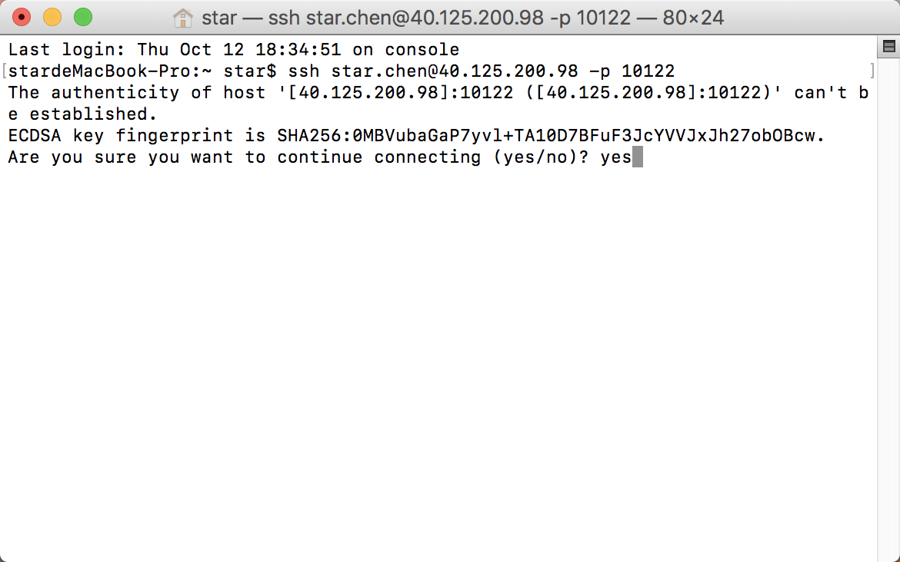
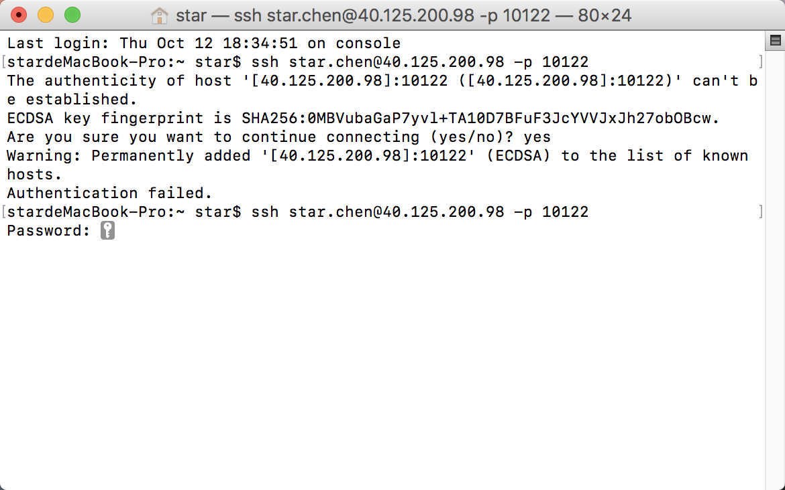
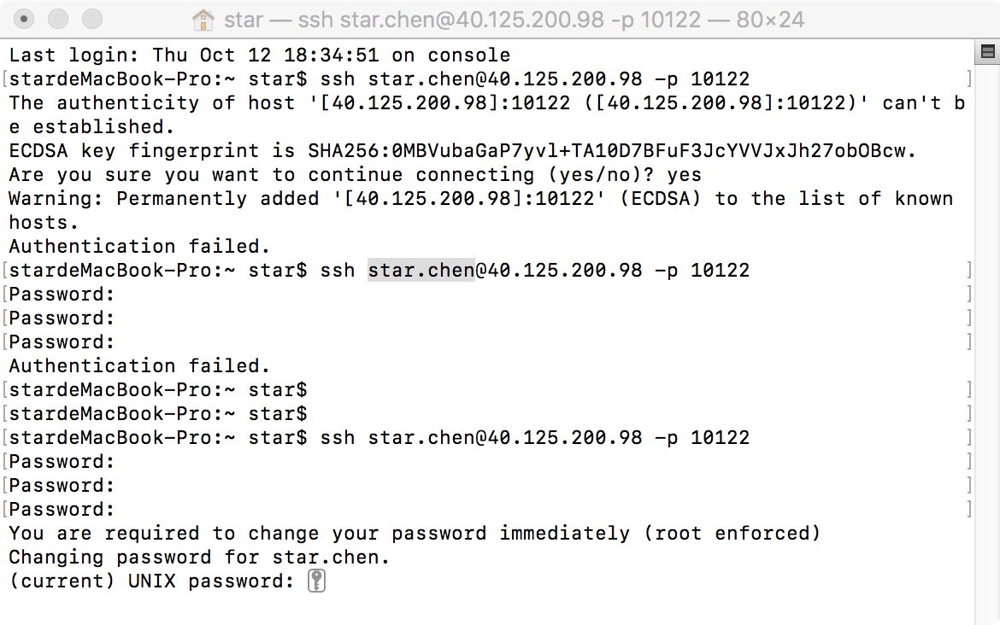
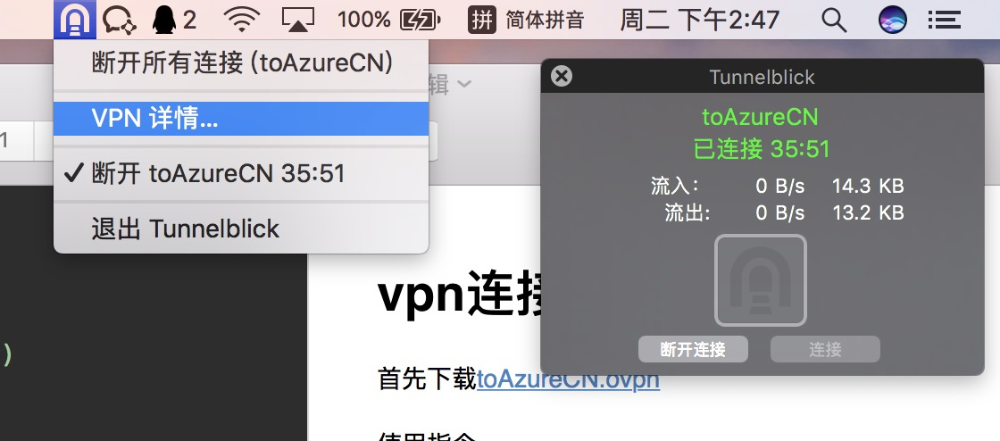

# vpn连接

>Abbott.liu

[网盘下载地址](https://share.weiyun.com/ceae836b115d6727a2d3fd32e28b89fe)

密码：5bN73t

然后点击[toAzureCN.ovpn](toAzureCN.ovpn)

在终端的页面使用指令

```
ssh 账号@40.125.200.98 -p 10122
```



提示

```
ECDSA key fingerprint is SHA256:0MBVubaGaP7yvl+TA10D7BFuF3JcYVVJxJh27obOBcw.
Are you sure you want to continue connecting (yes/no)? 
```

输入`yes`

然后输入初始密码



然后重置密码（要有大小写，还要有数字和英文）



点击**Tunnelblick.app**连接



